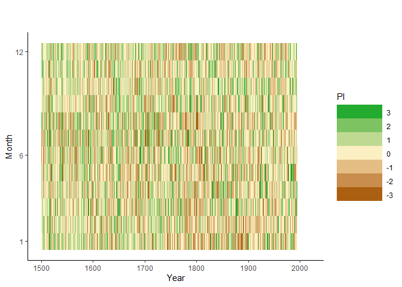

## Download Monthly Precipitatation Indices for Germany

Use tamboRapi to inq data (take some time)


```r
if (!require("devtools")) install.packages("devtools")
```

```
## Loading required package: devtools
```

```r
library("devtools")
devtools::install_github('tambora-org/tamboRapi')
```

```
## Skipping install of 'tamboRapi' from a github remote, the SHA1 (75e484f5) has not changed since last install.
##   Use `force = TRUE` to force installation
```

```r
library(dplyr)
```

```
## 
## Attaching package: 'dplyr'
```

```
## The following objects are masked from 'package:stats':
## 
##     filter, lag
```

```
## The following objects are masked from 'package:base':
## 
##     intersect, setdiff, setequal, union
```

```r
## Large chunks seem to fail, so try some redundancy import

precData0b <- tamboRapi::fromTambora("g[cid]=493&c[nd]=96&t[yb]=1500&t[ye]=1549")
```

```
## Loading required package: jsonlite
```

```
## Loading required package: httr
```

```
## Loading required package: sp
```

```
## Inquiring data from tambora.org:
## +----+----+----+----+----+----+----+----+----+----+
## ooooooooooooooooooooooooooooooooooooooooooooooooooo
## Finished
```

```r
precData0b <- distinct(precData0b, begin_year,begin_month_id, .keep_all= TRUE)
```

```
## Warning: The `printer` argument is deprecated as of rlang 0.3.0.
## This warning is displayed once per session.
```

```r
precData1 <- tamboRapi::fromTambora("g[cid]=493&c[nd]=96&t[yb]=1500&t[ye]=1599")
```

```
## Inquiring data from tambora.org:
## +----+----+----+----+----+----+----+----+----+----+
## ooooooooooooooooooooooooooooooooooooooooooooooooooo
## Finished
```

```r
precData1 <- distinct(precData1, begin_year,begin_month_id, .keep_all= TRUE)
precData1b <- tamboRapi::fromTambora("g[cid]=493&c[nd]=96&t[yb]=1550&t[ye]=1649")
```

```
## Inquiring data from tambora.org:
## +----+----+----+----+----+----+----+----+----+----+
## ooooooooooooooooooooooooooooooooooooooooooooooooooo
## Finished
```

```r
precData1b <- distinct(precData1b, begin_year,begin_month_id, .keep_all= TRUE)

precData2 <- tamboRapi::fromTambora("g[cid]=493&c[nd]=96&t[yb]=1600&t[ye]=1699")
```

```
## Inquiring data from tambora.org:
## +----+----+----+----+----+----+----+----+----+----+
## ooooooooooooooooooooooooooooooooooooooooooooooooooo
## Finished
```

```r
precData2 <- distinct(precData2, begin_year,begin_month_id, .keep_all= TRUE)
precData2b <- tamboRapi::fromTambora("g[cid]=493&c[nd]=96&t[yb]=1650&t[ye]=1749")
```

```
## Inquiring data from tambora.org:
## +----+----+----+----+----+----+----+----+----+----+
## ooooooooooooooooooooooooooooooooooooooooooooooooooo
## Finished
```

```r
precData2b <- distinct(precData2b, begin_year,begin_month_id, .keep_all= TRUE)

precData3 <- tamboRapi::fromTambora("g[cid]=493&c[nd]=96&t[yb]=1700&t[ye]=1799")
```

```
## Inquiring data from tambora.org:
## +----+----+----+----+----+----+----+----+----+----+
## ooooooooooooooooooooooooooooooooooooooooooooooooooo
## Finished
```

```r
precData3 <- distinct(precData3, begin_year,begin_month_id, .keep_all= TRUE)
precData3b <- tamboRapi::fromTambora("g[cid]=493&c[nd]=96&t[yb]=1750&t[ye]=1849")
```

```
## Inquiring data from tambora.org:
## +----+----+----+----+----+----+----+----+----+----+
## ooooooooooooooooooooooooooooooooooooooooooooooooooo
## Finished
```

```r
precData3b <- distinct(precData3b, begin_year,begin_month_id, .keep_all= TRUE)

precData4 <- tamboRapi::fromTambora("g[cid]=493&c[nd]=96&t[yb]=1800&t[ye]=1899")
```

```
## Inquiring data from tambora.org:
## +----+----+----+----+----+----+----+----+----+----+
## ooooooooooooooooooooooooooooooooooooooooooooooooooo
## Finished
```

```r
precData4 <- distinct(precData4, begin_year,begin_month_id, .keep_all= TRUE)
precData4b <- tamboRapi::fromTambora("g[cid]=493&c[nd]=96&t[yb]=1850&t[ye]=1949")
```

```
## Inquiring data from tambora.org:
## +----+----+----+----+----+----+----+----+----+----+
## ooooooooooooooooooooooooooooooooooooooooooooooooooo
## Finished
```

```r
precData4b <- distinct(precData4b, begin_year,begin_month_id, .keep_all= TRUE)

precData5 <- tamboRapi::fromTambora("g[cid]=493&c[nd]=96&t[yb]=1900&t[ye]=2000")
```

```
## Inquiring data from tambora.org:
## +----+----+----+----+----+----+----+----+----+----+
## ooooooooooooooooooooooooooooooooooooooooooooooooooooo
## Finished
```

```r
precData5 <- distinct(precData5, begin_year,begin_month_id, .keep_all= TRUE)
precData5b <- tamboRapi::fromTambora("g[cid]=493&c[nd]=96&t[yb]=1950&t[ye]=2000")
```

```
## Inquiring data from tambora.org:
## +----+----+----+----+----+----+----+----+----+----+
## ooooooooooooooooooooooooooooooooooooooooooooooooooooooo
## Finished
```

```r
precData5b <- distinct(precData5b, begin_year,begin_month_id, .keep_all= TRUE)

precData <- rbind(precData1,precData2,precData3,precData4,precData5)
precData <- distinct(precData, begin_year,begin_month_id, .keep_all= TRUE)

precDataB <- rbind(precData0b,precData1b,precData2b,precData3b,precData4b,precData5b)
precDataB <- distinct(precDataB, begin_year,begin_month_id, .keep_all= TRUE)

precData0 <- tamboRapi::fromTambora("g[cid]=493&c[nd]=96&t[yb]=1500&t[ye]=2000")
```

```
## Inquiring data from tambora.org:
## +----+----+----+----+----+----+----+----+----+----+
## ooooooooooooooooooooooooooooooooooooooooooooooooooo
## Finished
```

```r
precData <- rbind(precData, precData0)
precData <- rbind(precData, precDataB)
precData <- distinct(precData, begin_year,begin_month_id, .keep_all= TRUE)
```

## Convert to simple time series data


```r
library(dplyr)

precTs <-  data.frame(precData$begin_year, precData$begin_month_id, precData$value_index)
names(precTs)[names(precTs) == "precData.begin_year"] <- "year"
names(precTs)[names(precTs) == "precData.begin_month_id"] <- "month"
names(precTs)[names(precTs) == "precData.value_index"] <- "pi"
precTs$ts <- signif(precTs$year + (precTs$month-0.5)/12, digits=6)
precTs$time <- paste(precTs$year,precTs$month, '15 00:00:00', sep='-')

precTs <- distinct(precTs, year,month, .keep_all= TRUE)
precTs <- precTs[order(precTs$ts),]
```

## Store as csv file


```r
write.table(precTs, file = "csv/pi_1500_2xxx_monthly.csv", append = FALSE, quote = TRUE, sep = ",",
            eol = "\n", na = "NA", dec = ".", row.names = FALSE,
            col.names = TRUE, qmethod = "escape", fileEncoding = "UTF-8")
```

## Plot Drought time line


```r
require("ggplot2")
```

```
## Loading required package: ggplot2
```

```
## Warning: package 'ggplot2' was built under R version 3.5.3
```

```r
mp <- ggplot(precTs, aes(year, month))
mp + geom_raster(aes(fill=pi))+
  #theme_classic(base_size=80) +
  theme_classic() +
  labs(x="Year", y="Month", title="", subtitle="") +
  scale_y_continuous(breaks=c(1,6,12))+
  scale_x_continuous(limits=c(1500,2020)) +  
  scale_fill_gradient2(low="#AA6010", mid="#FCF0C2", high="#23AB30",
                       limits=c(-3,3)) +
  theme( legend.key.width = unit(2,"cm")) +
  guides(fill=guide_legend(title="PI", reverse = TRUE))  
```

<!-- -->


